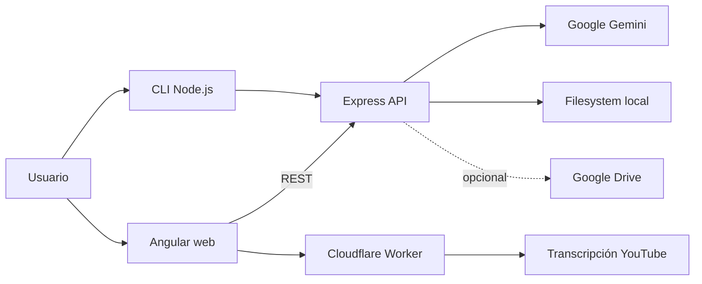

# yt-transcriber

> Convierte transcripciones, textos y extractos extensos en documentos Markdown organizados mediante IA, y permite consultar luego ese contenido con preguntas.

`yt-transcriber` es un proyecto full-stack orientado a automatizar la limpieza y estructuración de texto sin ocultar su origen ni eliminar contenido. Combina una API Node.js/Express, un cliente Angular y proveedores externos configurables.

## Qué demuestra

- Integración con Google Gemini para procesamiento y análisis de texto.
- Flujo YouTube → transcripción → API → documento Markdown.
- Aplicación web Angular y CLI para distintos flujos de trabajo.
- Persistencia local y sincronización opcional con Google Drive.
- Separación progresiva hacia adaptadores reemplazables para IA, almacenamiento y transcripciones.

## Funcionalidades

- Procesar transcripciones de YouTube, archivos `.txt`, `.md` y `.pdf`.
- Organizar párrafos, secciones, timestamps y metadata YAML.
- Corregir errores de transcripción u OCR y traducir cuando corresponde.
- Analizar documentos y hacer preguntas sobre su contenido.
- Guardar resultados localmente o en Google Drive cuando está configurado.

## Arquitectura actual



El objetivo arquitectónico documentado en [`ai/plan-implementacion-portfolio.md`](ai/plan-implementacion-portfolio.md) es reemplazar dependencias concretas mediante puertos y adaptadores, sin modificar los casos de uso al cambiar de proveedor.

## Inicio rápido

### Requisitos

- Node.js 18 o superior.
- Una API key de [Google Gemini](https://aistudio.google.com/app/apikey).
- Node.js/npm para el frontend Angular.

### Backend y CLI

```bash
npm install
Copy-Item .env.example .env
# Editar .env y completar GOOGLE_GENERATIVE_AI_API_KEY
npm start
```

La API queda disponible en `http://localhost:3000`. Para usar el CLI:

```bash
npm run cli
```

### Frontend web

En otra terminal:

```bash
cd electron-angular-test
npm install
npm start
```

Abrir `http://localhost:4200`. Para que Express sirva una build del frontend:

```bash
npm run build
cd ..
npm start
```

La guía detallada de configuración, CLI, Google Drive y troubleshooting está en [`docs/INSTRUCTIVO.md`](docs/INSTRUCTIVO.md).

## Configuración

Usá [`.env.example`](.env.example) como referencia. La configuración actual mínima es:

```env
GOOGLE_GENERATIVE_AI_API_KEY=tu_api_key
```

Las credenciales `credentials.json`, `token.json`, `.env` y los datos locales están excluidos del repositorio. Nunca compartas esos archivos ni pegues sus valores en issues, capturas o commits.

## Endpoints principales

| Método | Ruta | Propósito |
|---|---|---|
| `GET` | `/api/health` | Verificar que la API está disponible. |
| `POST` | `/api/process` | Procesar texto o archivo. |
| `POST` | `/api/analyze` | Analizar un documento y responder preguntas. |
| `GET` | `/api/drive-test` | Diagnosticar la integración opcional con Drive. |

## Calidad y estado conocido

El proyecto está en preparación para portfolio. El build Angular está configurado y la documentación de uso está disponible; el comando de tests raíz todavía es un placeholder y será reemplazado durante la Fase 4 del plan. No se presenta como un servicio de producción.

Las limitaciones actuales incluyen dependencia de subtítulos accesibles para YouTube, consumo de una API externa de IA y configuración adicional para Google Drive.

## Plan de implementación

El trabajo se registra en [`ai/`](ai/):

1. Seguridad y publicación.
2. README y presentación.
3. Limpieza estructural.
4. Adaptadores reemplazables para IA, almacenamiento y transcripciones.
5. Tests, lint y cobertura.
6. CI/CD y reproducibilidad.
7. Robustez, accesibilidad y demo.

## Licencia

Actualmente el proyecto conserva la licencia declarada en `package.json`. La licencia pública definitiva debe confirmarse antes de publicar el repositorio.
